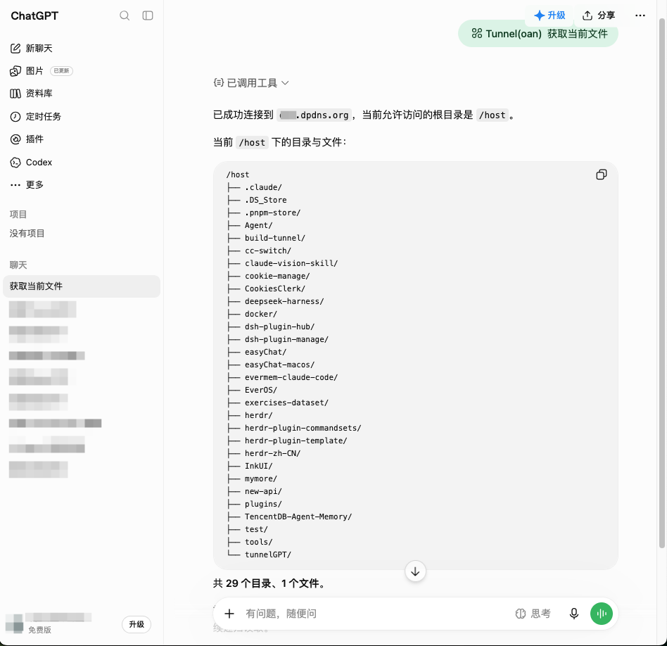

# Local ChatGPT 搭建文档

使用 WebChatGPT 不会消耗你 Plan 的额度，这个项目让 Web ChatGPT 读写本地文件以及更多可能。



## 一句话执行

把下面这段丢给 Claude Code 等 agent：

```bash
项目地址：`https://github.com/Dante926/build-tunnel`读取 `skills/cloudflare-mcp-tunnel/SKILL.md` 并严格执行。开始前先确认：① 项目来源；② 目录及读写权限；③ 浏览器操作方案；需要我本人操作的步骤（邮箱验证码、人机校验、Zero Trust 绑卡、OAuth 授权）
```

## 链路

```
ChatGPT（云端）
  │  HTTPS  https://mcp.<域名>/mcp
  ▼
Cloudflare 边缘        证书终结 + 身份验证
  │  ingress 转发规则
  ▼
cloudflared            常驻出站连接
  │  compose 内网
  ▼
mcpjungle              把 stdio 的 MCP 包成 HTTP 端点
  │  stdio 子进程
  ▼
filesystem MCP server
  ▼
本机文件夹
```

## 文档

| #   | 文档                                                                       | 内容                                   |
| --- | -------------------------------------------------------------------------- | -------------------------------------- |
| 01  | [从零搭建](./docs/01-从零搭建.md)                                          | 总览、链路图、前置条件                 |
| 02  | [DigitalPlat 获取域名](./docs/02-DigitalPlat获取域名.md)                   | 免费申请 `.dpdns.org`                  |
| 03  | [Cloudflare 绑定域名与创建隧道](./docs/03-Cloudflare绑定域名与创建隧道.md) | NS 托管到 Cloudflare、建隧道拿 token   |
| 04  | [Docker-Tunnel-MCP](./docs/04-Docker-Tunnel-MCP.md)                        | 三服务 compose、注册 filesystem server |
| 05  | [ChatGPT 添加自定义插件](./docs/05-ChatGPT自定义插件.md)                   | Public Hostname、ChatGPT 连接器        |
| 06  | [Cloudflare OAuth 认证](./docs/06-OAuth%20认证.md)                         | Cloudflare Access、Managed OAuth       |

## 从零恢复

```sh
cp .env.example .env     # 填入 TUNNEL_TOKEN
docker compose up -d
docker compose ps        # db 需为 healthy
./scripts/register.sh    # 注册 filesystem MCP server
```

Cloudflare 侧的面板配置（隧道、Public Hostname、Access 应用）不在版本控制里，
需照 03、05、06 三篇手工重建。

## 相关文件

| 路径                    | 说明                                       |
| ----------------------- | ------------------------------------------ |
| `./docker-compose.yaml` | 三个服务的编排                             |
| `./mcp/filesystem.json` | filesystem server 注册配置                 |
| `./scripts/register.sh` | 重新注册 server（`down -v` 后恢复）        |
| `./skills/`             | agent 用的编排 skill，见上方「一句话执行」 |
| `./.env.example`        | 环境变量模板，真实 token 放 `.env`         |
| `./docs/assets/`        | 文档配图                                   |

## 约定

- 文中 `xxx.dpdns.org` 是占位符，替换成你自己的域名
- 隧道 token 属密钥，只放 `.env`，不要提交进 git
- `mcpjungle` 以 `:rw` 挂载本机目录，ChatGPT 因此**可以改写、删除该目录下任何文件**

## 免责声明

本项目仅用于个人学习与技术研究，打通的是「本机服务 ↔ ChatGPT」这条链路。
它不修改、不逆向、不绕过 OpenAI 的任何产品或服务，也不分发 OpenAI 的代码、凭据或用户数据。
使用者需自行确保自己的使用方式符合 OpenAI 服务条款及所在地法律法规。

如本项目内容无意中侵犯了 OpenAI 或其他第三方的合法权益，请通过
**umiying86@gmail.com** 与我联系，我会尽快处理。
