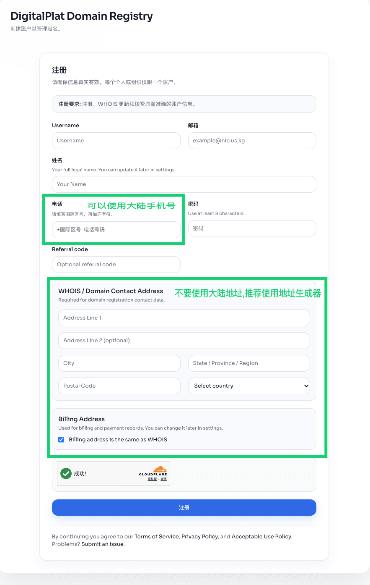
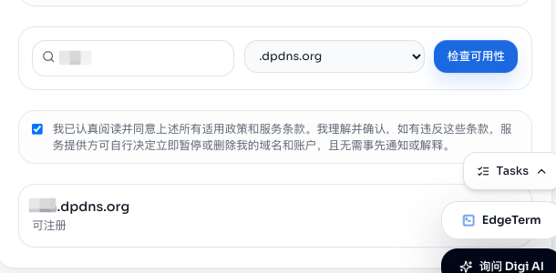
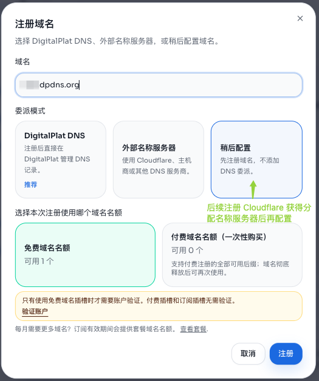

# DigitalPlat 获取域名

在 [DigitalPlat](https://dashboard.digitalplat.org) 免费申请一个 `.dpdns.org` 域名。

## 步骤

1. [注册DigitalPlat](https://dashboard.digitalplat.org/auth/login)
   
2. 注册后进入 [DigitalPlat 仪表盘](https://dashboard.digitalplat.org/dashboard)
3. 点击[免费注册域名](https://dashboard.digitalplat.org/registration)
4. 流程:

   **DigitalPlat 域名**  
   ↓  
   下拉至底部  
   ↓  
   勾选同意协议  
   ↓  
   选择选项框  
   ↓  
   选择 `.dpdns.org` 作为域名后缀  
     
   ↓  
   任意你喜欢的域名  
   ↓  
   检查可用性  
   ↓  
   注册  
   

## 注意事项

- 推荐[地址生成器](https://usaddressgen.com/)
- 注册手机号可以是国区 +86
- 注册地址不要出现中文
- 输入 username 时，字符长度要超过 5
- 输入姓名时，姓与名之间要有空格符（space）
- 注册完成后绑定一个 GitHub 账号
