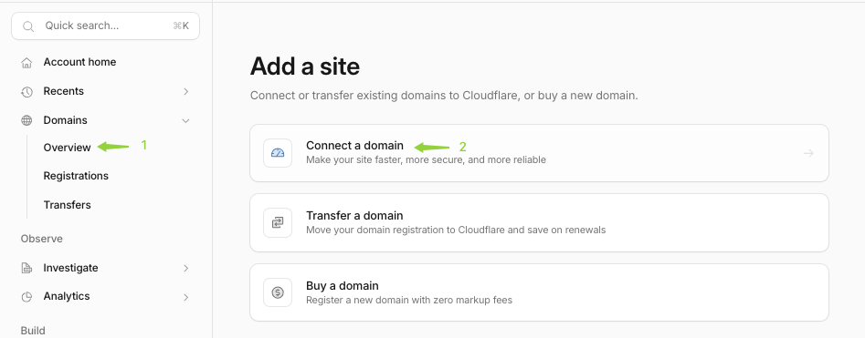
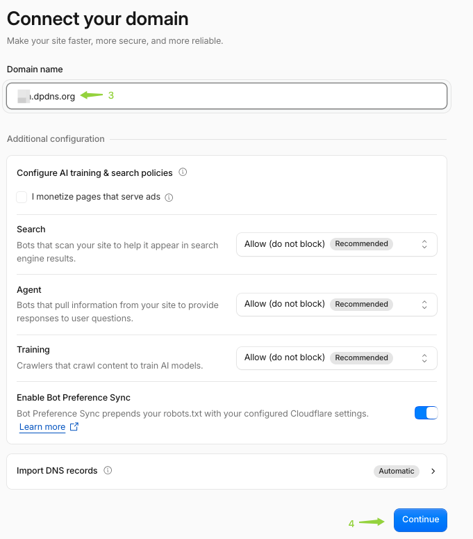
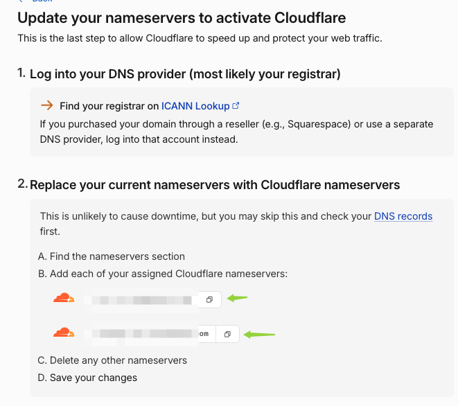
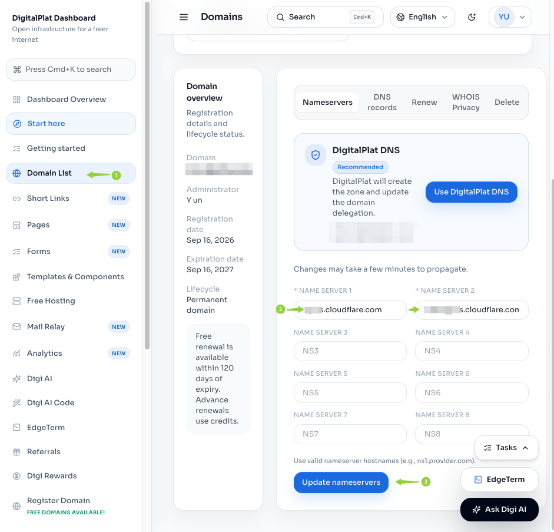
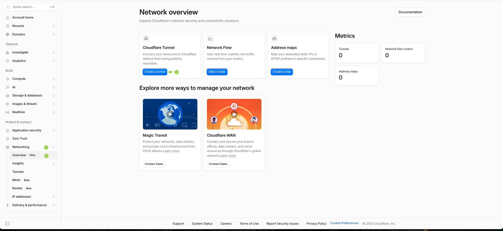
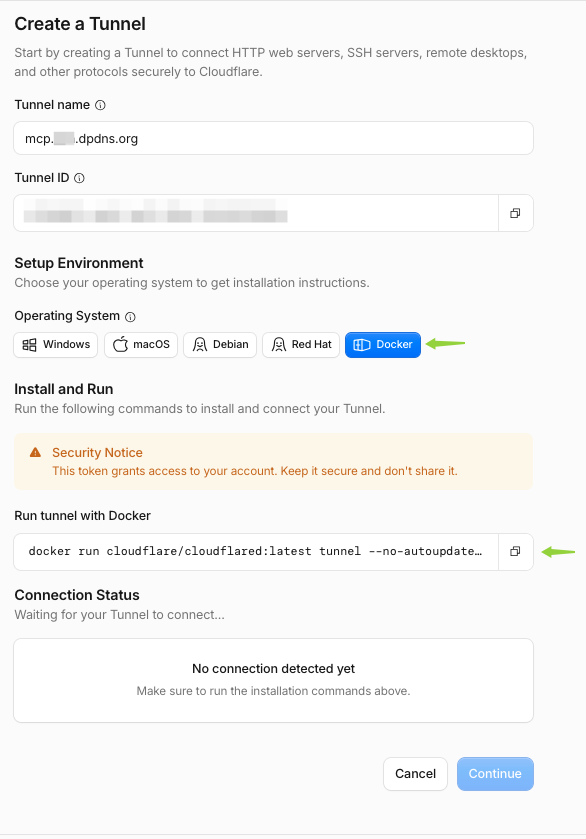

# Cloudflare 绑定域名与创建隧道

## 将域名托管至 Cloudflare

1. [注册 Cloudflare 账号](https://dash.cloudflare.com/sign-up)
2. **navigate**→ **Domains** → **Overview** → **Add domain** → **connect a domain** → Continue
   
3. 跳转至计划选择 → 选择**免费计划** → 跳转至 **"Review your DNS records"**
4. Review your DNS records → 下拉至底部 → 选择 **"Continue to activation"** → **Confirm** → 跳转至更新名称服务器页
5. 更新名称服务器页 → 复制 Cloudflare 分配的两个名称服务器
   
6. 回到 **DigitalPlat**：
   - 选择["Domain List"](https://dashboard.digitalplat.org/domains) → 点击域名进入域名管理页
   - 找到 **使用其他名称服务器** → 点进去
   - 把复制的两个 Cloudflare 名称服务器粘贴进待填项 → 更新名称服务器
     
7. 回到 Cloudflare 名称服务器管理界面 → 下拉找到 **"I updated my nameservers"**
8. 等待 Cloudflare 更新注册表。刷新界面后会看到 **"Your domain is now protected by Cloudflare"**

## 在 Cloudflare 中建立隧道

1. 回到 Cloudflare /home
2. 侧边导航栏找到 **Networking** → **Overview** → **Create a tunnel** → 输入任意 **Tunnel name** → 点击 **Create Tunnel** → 进入 Create Tunnel 详情页
   
3. 选择 Docker 操作系统 → 复制 "Run tunnel with Docker" 指令：
   

```sh
docker run cloudflare/cloudflared:latest tunnel --no-autoupdate run --token <TUNNEL_TOKEN>
```

> 下一章会把它从命令行参数挪进 `.env` 文件，由 docker compose 注入。
