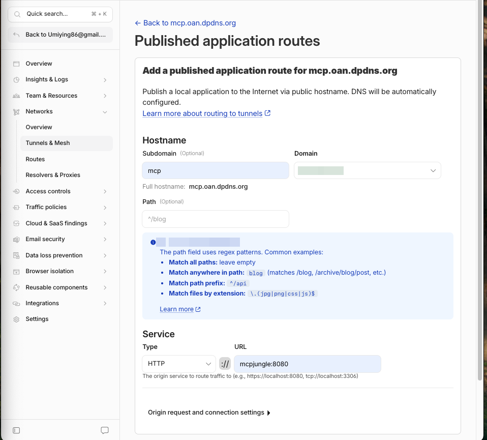

# 连接 ChatGPT

这一步做两件事：

1. 在 Cloudflare 暴露一个 public hostname，与隧道建立连接
2. 给隧道添加 ingress 转发规则

## 1. 暴露 Public Hostname

**Zero Trust** 面板 → **Networks** → **Tunnels** → 你的隧道 → **Published application routes** → **Add**

| 字段 | 值 |
| --- | --- |
| Subdomain（可选） | `mcp` |
| Domain | 你的域名 |
| Path（可选） | 空 |
| Type | `HTTP` |
| URL | `mcpjungle:8080` |

> **`URL` 填的是容器名加容器内端口**，不是宿主机的 `127.0.0.1:8080`。
> cloudflared 与 mcpjungle 在同一个 compose 网络里，服务名可以直接当主机名解析。

## 2. 在 ChatGPT 中添加连接器

ChatGPT → 设置 → 连接器 → 添加自定义连接器：

| 字段 | 值 |
| --- | --- |
| Name | 任意 |
| Description（可选） | 任意 |
| **URL** | `https://mcp.xxx.dpdns.org/mcp` |
| **Authentication** | `No Auth` |

确认连接后即可在 ChatGPT 中进行工具调用。

> 这一节先走**无验证**版本，把链路打通。验证通过后再按
> [06-OAuth 认证](./06-OAuth%20认证.md) 加上 Cloudflare Access 保护。

## 排查：连接失败

如果 ChatGPT 出现 connect 失败，检查 SSL/TLS 证书是否已由 Cloudflare 验证发放：

**Cloudflare** → 域名 → `xxx.dpdns.org` → **SSL/TLS** → **Edge Certificate**

证书未签发时，TLS 握手会在边缘直接失败，请求根本到不了隧道。
